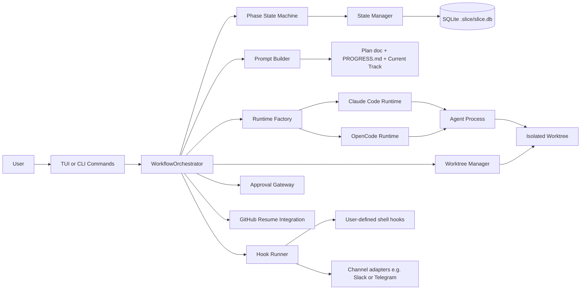
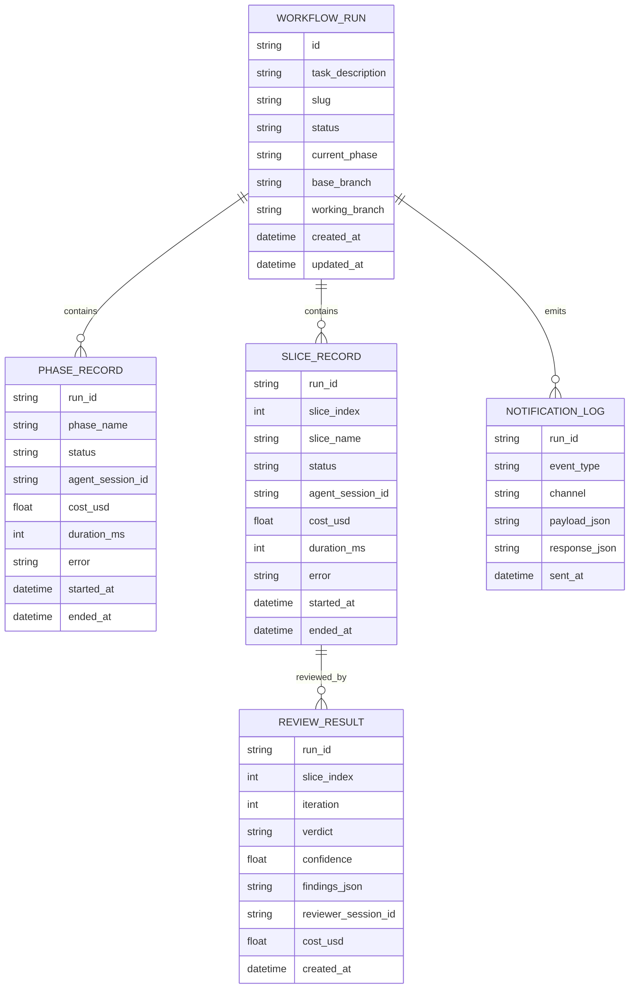
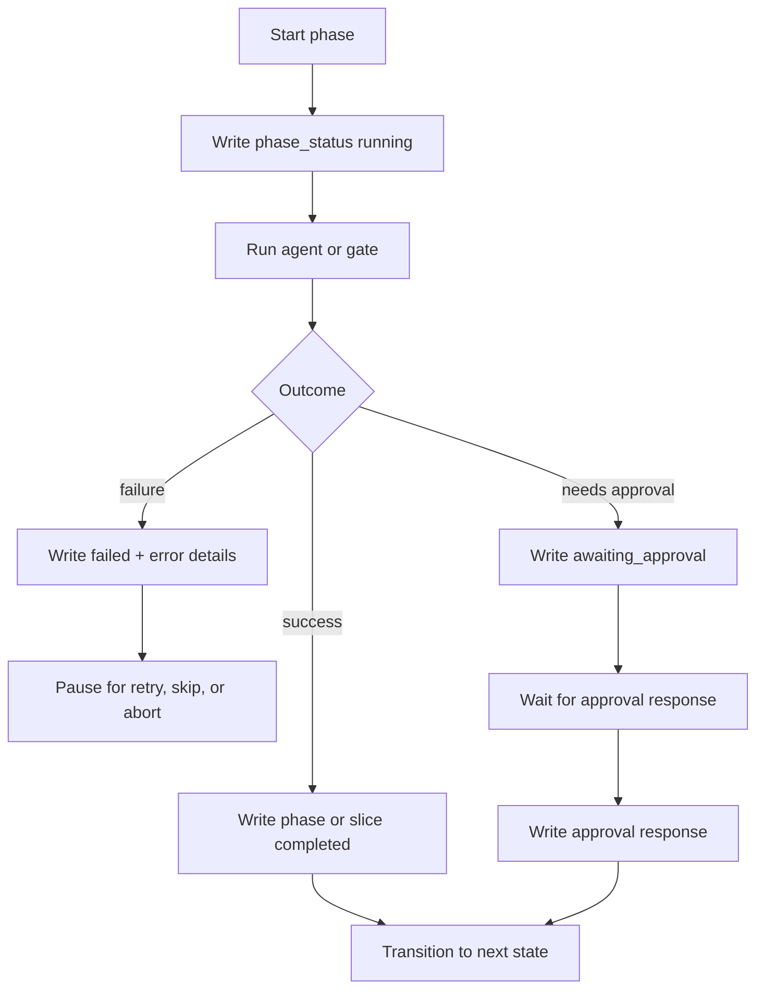
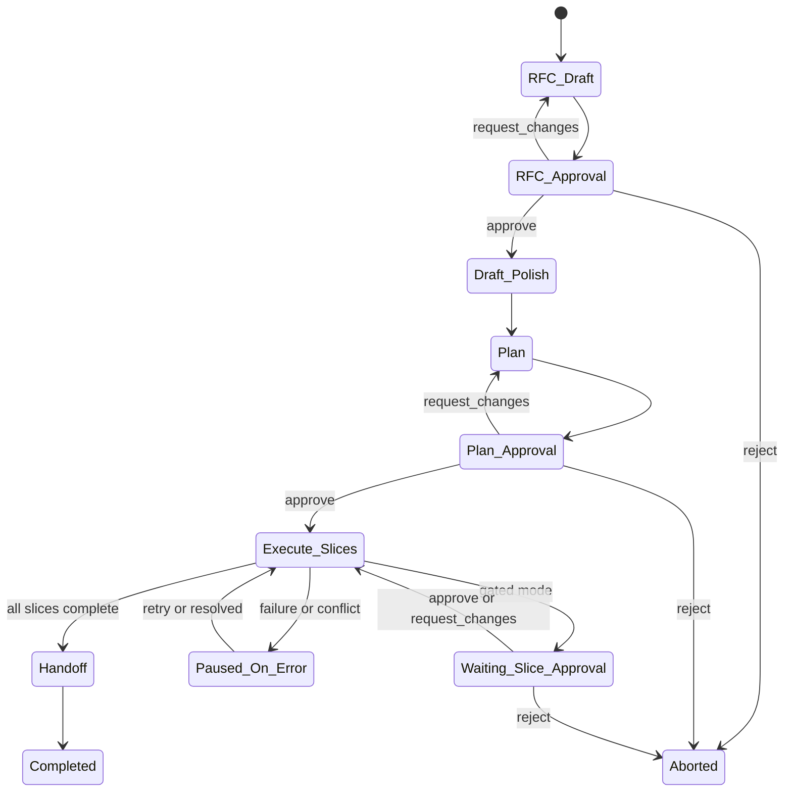
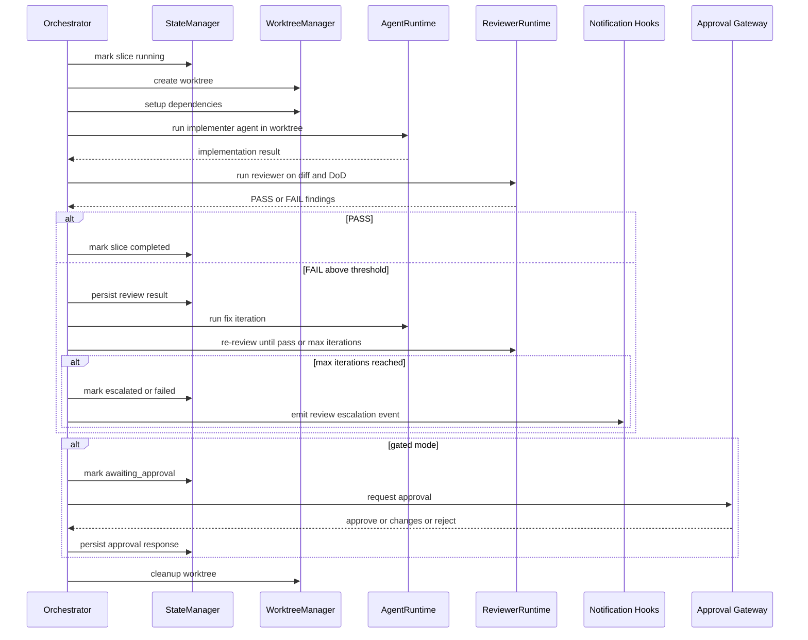
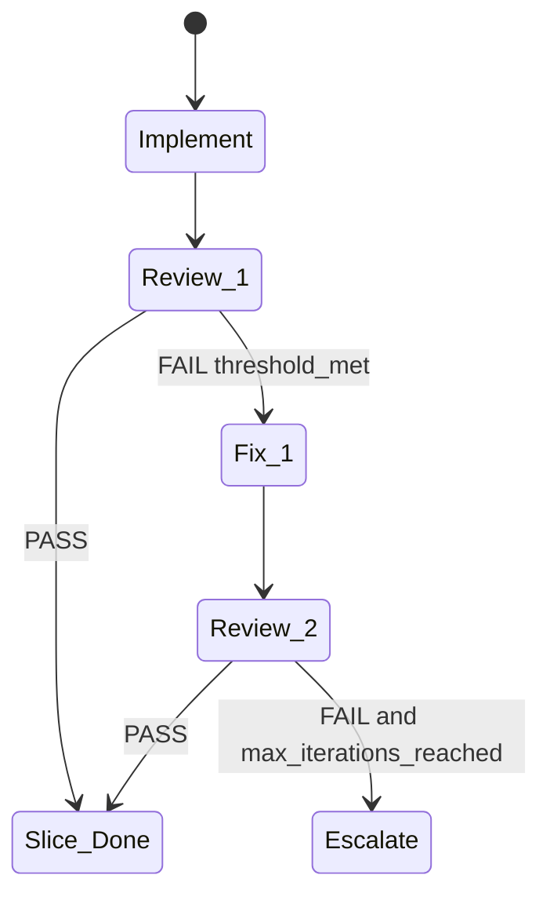
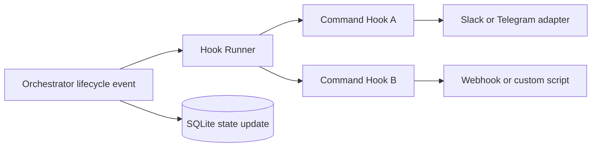
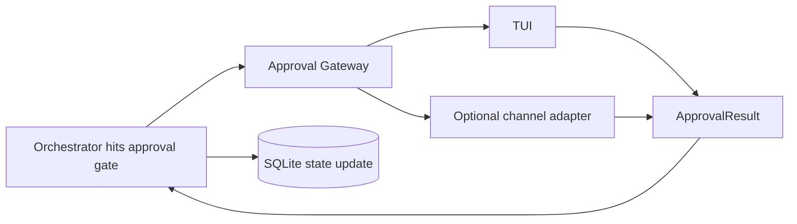

# Architecture: `slice` CLI Orchestrator

## Purpose and scope

This document explains how `slice` works as an integrated architecture, with focus on runtime behavior, state management, and component wiring.

Status update (April 8, 2026): notifications are being migrated from hardcoded Slack/Telegram fan-out to lifecycle hooks. Approval gating remains separate and channel-agnostic.

## System at a glance

`slice` is a local orchestration system that coordinates AI agents to move a task from idea to PR through deterministic phases.

- Orchestration and control logic run in the CLI process.
- Code changes are produced by agent runtimes in isolated Git worktrees.
- Human-readable implementation context is stored in project files (`implementations/...`).
- Machine-execution state is persisted in SQLite (`.slice/slice.db`) for checkpointing, auditability, and resumability.

## Architectural model: two data planes and one control plane

### 1) Control plane

The orchestrator is the control plane. It decides what phase runs next, when approvals are needed, when retries happen, and when the workflow is paused or completed.

### 2) Human context plane (filesystem)

This plane exists for agent context and human review:

- `implementations/{slug}/{slug}.md` (plan doc)
- `implementations/{slug}/PROGRESS.md` (key decisions record)
- `implementations/{slug}/tracks/*.md` (per-slice docs)

These files are readable, diffable, and git-tracked.

### 3) Machine state plane (SQLite)

This plane exists for orchestration integrity:

- Current and historical workflow execution status
- Phase/slice/review progress and costs
- Hook notification executions and approval outcomes
- Crash-safe checkpoints for resume

This state is local runtime metadata and is gitignored.

## Why SQLite exists in the system

SQLite is the orchestrator's durable memory. It is not where code lives and not where planning docs live.

Without SQLite, the orchestrator would lose execution position on crash and could not reliably answer questions like:

- Which phase is currently active?
- Which slice failed and why?
- Is the run waiting for approval?
- How many review iterations have already happened?
- What is the cumulative runtime cost?

SQLite is chosen over JSON files because the system needs atomic updates, queryability, migration support, and future-safe concurrent access.

## SQLite state model

The plan defines these logical records:

- Workflow runs
- Phase records
- Slice records
- Review results
- Notification log

## Checkpoint semantics and resume behavior

State is updated at every critical boundary. Typical checkpoints include:

- Phase starts and finishes
- Slice starts, fails, completes, or enters `awaiting_approval`
- Reviewer verdict per iteration
- Notification sent and user response received

If the process crashes, resume logic reads `.slice/slice.db` and reconstructs control-plane position deterministically.

## End-to-end workflow state machine

## Slice execution engine wiring

Each slice runs in an isolated worktree. The orchestrator owns lifecycle and state transitions.

## Review loop as a bounded sub-state machine

Key behavior constraints:

- Reviewer scope is bounded to DoD and introduced diff.
- Only findings at or above configured severity trigger fix loops.
- `maxIterations` prevents unbounded loops.
- Every verdict is persisted for auditability.

## Component responsibilities and interfaces

| Component | Responsibility | Reads | Writes |
|---|---|---|---|
| CLI + TUI (`src/cli`) | User entrypoints, interactive views, local approvals fallback | Config, DB status | User actions into orchestrator |
| WorkflowOrchestrator (`src/orchestrator/index.ts`) | Runs workflow phases and transitions | Config, plan artifacts, DB state | Phase/slice execution events |
| State machine (`src/orchestrator/state-machine.ts`) | Valid transitions and progression logic | Current state | Next state decision |
| StateManager (`src/state`) | Persistence API for machine state | SQLite rows | SQLite rows |
| Runtime layer (`src/runtime`) | Provider-neutral agent invocation | Prompts + context + cwd | Agent output, session IDs, cost |
| SliceExecutionContext (`src/runtime/slice-context.ts`) | Read/write contract for each slice agent | Plan doc, PROGRESS.md, track doc, cost | Read-only contract; worktreePath is the only writable root |
| WorktreeManager (`src/orchestrator/worktree.ts`) | Worktree create/setup/cleanup and isolation | Repo git state | Worktree filesystem |
| Prompt builder (`src/prompts`) | Deterministic prompt composition | Plan doc, PROGRESS.md, current track | Prompt strings |
| Approval gateway (`src/cli/ui/approval-gate.ts`) | Collect approval decisions (TUI or adapter-backed channel), return `ApprovalResult` | Approval request payload | Approval decision persisted to state |
| Hook runner (`src/hooks/runner.ts`) | Fire user-defined shell commands at lifecycle events | HookDefinitions from config | stdout responses; can signal abort |
| DiagnosticTracker (`src/diagnostics/tracker.ts`) | Capture tsc/lint/test baselines and compute post-slice delta | Worktree output | DiagnosticDelta for reviewer prompt |
| GitHub resume integration (`src/github`) | Resume context from PR review feedback | PR comments and diff context | Resume invocation context |

## Approval and notification wiring

Notification delivery is hook-first. Approval remains a separate contract that can use TUI-only or adapter-backed channels.

Behavioral rule: first valid response wins when multiple channels respond.

## Runtime abstraction and provider independence

`AgentRuntime` is the key boundary that prevents orchestrator lock-in to one agent provider.

- `run(...)` for autonomous phases (e.g. Draft Polish, slice execution)
- `runInteractive(...)` for interactive conversational phases (RFC Draft and Plan)
- standard result contract including success, output, session ID, cost, and duration

This allows the same orchestration and persistence logic to run with Claude Code or OpenCode.

## Worktree isolation model

Worktrees are a safety boundary, not just a git convenience.

- Each slice gets a dedicated worktree and unique branch.
- Agent `cwd` is set to that worktree.
- Destructive mistakes stay contained to the slice workspace.
- Orchestrator handles setup and cleanup; agents stay focused on implementation.

A `SliceExecutionContext` (`src/runtime/slice-context.ts`) formalizes the read/write contract before each slice runs. It exposes read-only fields (plan doc, PROGRESS.md, track doc, cumulative cost, remaining budget) and the writable `worktreePath`. The agent system prompt is built from this context and explicitly states the write boundaries. Post-slice, the orchestrator (not the agent) owns the merge back to the working branch and SQLite state update.

## Failure model and recovery paths

### Failure classes

- Agent execution error
- Merge conflict
- Reviewer loop exhaustion
- Approval rejection
- Process crash
- Transient API failure (rate limit, timeout, server error)
- Budget exhaustion

### Recovery model

- Operational failures update SQLite with precise status and error metadata.
- Transient failures (`RetryableError`) are retried automatically with exponential backoff + jitter via `withRetry()` in `src/utils/retry.ts`. Rate-limit `retry-after` headers inform the backoff delay.
- Budget exhaustion (`BudgetExhaustedError`) halts the workflow immediately and notifies the user.
- Fatal errors propagate immediately without retry.
- Notifications can request user action (retry, resolve, reject).
- Process crashes recover through DB checkpoint inspection.
- `slice status` and resume commands are driven by persisted machine state.

## How `slice status` is powered

`slice status` is a read-model over SQLite, not over filesystem docs.

It can show:

- current workflow phase
- current slice and status
- pending approvals
- failures and latest errors
- timing and cumulative costs

This is possible because machine state is normalized and queryable in DB records.

## Separation of concerns summary

- Filesystem artifacts answer: what was planned, why decisions were made, and what each slice did.
- SQLite answers: what the orchestrator is doing right now, what happened operationally, and how to continue safely.
- Orchestrator and state machine answer: what should happen next.

That separation is what makes the system both agent-friendly (clear context files), human-friendly (readable docs), and operationally robust (durable control-plane state).

## Forward compatibility notes

This architecture is intentionally prepared for later parallel slice execution.

Parallelism readiness comes from:

- provider abstraction (`AgentRuntime`)
- isolated worktrees per slice
- queryable, concurrent-safe SQLite machine state
- explicit phase/slice status records instead of implicit in-memory progress
